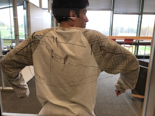
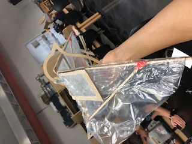
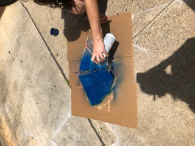
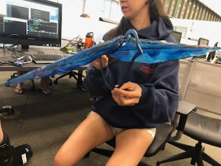
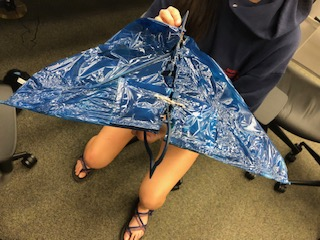
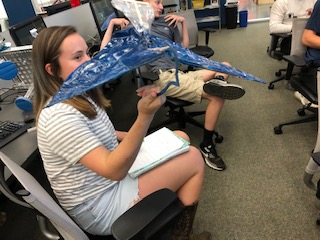
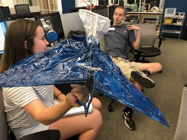
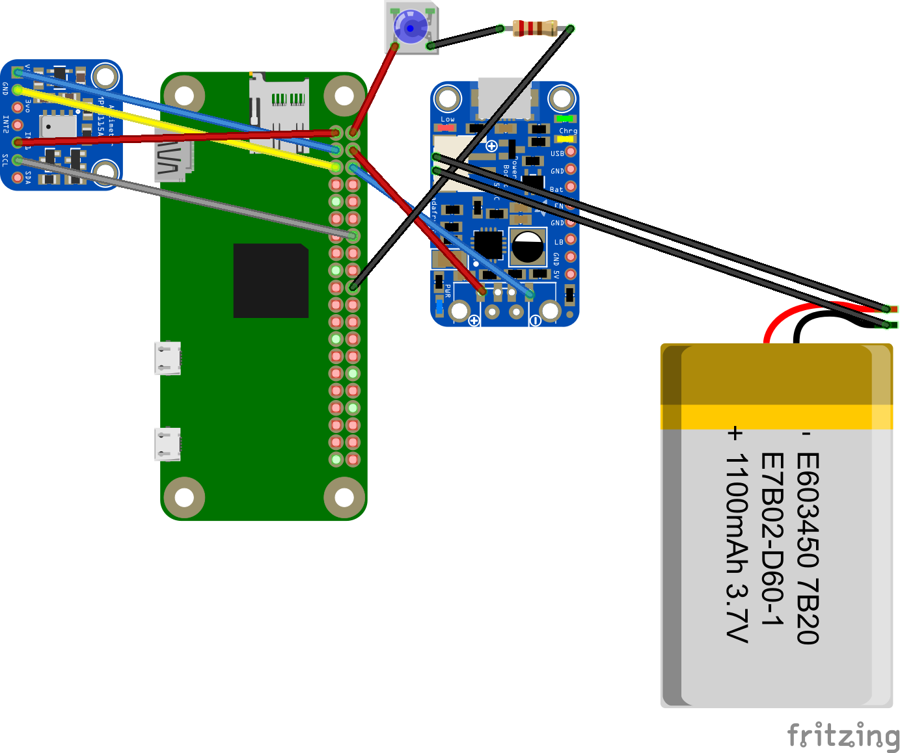

# Bird

## Project Planning

Goal:

Making a bird, with a raspberry pi on it, that will flap it's wings, know when it's at it's top altitude, and measure it's own acceleration. When the bird is at it's highest altitude, and LED will light up. 

http://students.iitk.ac.in/aeromodelling/downloads/rubber_band_ornithopter.pdf

https://makezine.com/projects/make-08/building-an-ornithopter/

https://youtu.be/Pn5pPy9BX3w 

https://www.revolvy.com/page/Ornithopter

https://scioly.org/wiki/index.php/Flying_Bird

https://youtu.be/AF4SqJF6PdA

http://www.ornithopter.org/

https://makezine.com/projects/make-08/building-an-ornithopter/

http://www.ornithopter.org/how.1.shtml

https://www.ornithopter.org/how.motor.shtml

https://www.instructables.com/id/make-an-ornithopterchirothopter/

http://www.the-nref.org/content/building-robotic-bird

http://www.ornithopter.org/how.wing.shtml
	

FIRST STEP: START WITH RUBBER BAND ORNITHOPTER
Some people don't want to start with a rubber-band-powered ornithopter, because it doesn't seem technologically advanced. But the rubber-powered ornithopter will teach you important concepts and skills that you will find useful when you start building more complex ornithopters. You will progress more rapidly by having this foundation. The rubber-powered ornithopter itself has become highly developed, with some very unique designs and advanced concepts.
https://www.instructables.com/id/Ornithopter/

The wing membrane can be made from a plastic film. This is suitable, even for very large RC ornithopters. Look for a crisp, "cellophane" type of plastic, instead of a limp saran-wrap type. Sometimes a woven fabric is used. The fabric wings can look very professional. However, it will be difficult to find a woven material that is crisp, lightweight, and airtight. Some of the fabrics specially made for kites may be appropriate. The Ornithopter Design Manual has more information on assembling fabric wings.

Notice one thing about the servo-powered wings. The servo for the right wing is going clockwise to raise the wing. Meanwhile, the servo for the left wing is going counter-clockwise. For this reason, the actual pulse width that you send to the servo is going to be different for the two servos. If the neutral position is 1500 μs, then the top of the upstroke might be 1800 μs for the right wing, and 1200 μs for the left wing. At full power, you will want to flap the wings through an angle of about 60 degrees.

We can raise or lower the flapping arc to make the bird go up or down. Raising the wings results in a higher line of thrust, which points the nose of the bird downward. Lowering the flapping arc gives you a lower line of thrust and pitches the bird up toward the sky. This works in flapping or gliding flight, and it has the same effect as the elevator control on an airplane. Since the left and right servos are normally running in opposite directions to flap the wings, we are going to add to one servo pulse while subtracting from the other.

Mylar, a trade-name for thin sheets of a plastic known as polyethylene terephthalate. This material is extremely strong and very light.

For gliding, we set the wings at a certain position, which is usually about 15 degrees above horizontal.

High flying bird
Were gonna paint our birdlike so cutely
It’s gonna make cute chirping noises
Cute little wings that flap
Our goal is to create a mechatronic flying machine shaped as a bird with wings
Wings made of some sort of tent material- needs to be light
Framing should be plastic so it’s not too heavy?
Maybe pvc pipes for the edges of the wings
Actually use tent stakes 
Maybe fiberglass tent things- light and strong\
Carbon fiber rods
Bamboo rods

What we need to build:
A frame that is light, but strong
Needs to hold 3 servos, motor, raspberry pi, battery
Wings, tail
Use tent?

Dimensions: 
Body: 14 inches long

## Resources and Constraints

We don't have a whole lot of time left to work on this project, especially since seniors leave earlier than the rest of the school. However, we have access to a lot of resources with everything in the sigma lab, and we can also bring stuff from home for our project. One problem is that the only bird that has ever been made that can actually flap it's wings and fly is from an actual big company, and so it will be very difficult to figure out how to make our bird actually work. 

After much brainstorming, we decided to make a bird because nobody else has ever done it and we figured that it will be adorable. We were also considering creating a rocket or cannon, but we didn't want to do the same thing as everybody else and wanted to challenge ourselves.  However, with this decision we realize that our goal is very ambitious and it is very possible the bird will never work. For us this is worth the risk, because we don't want to do something easier since it will be more boring, and we want to be unique. Our biggest challenge in making the bird will be getting the wings to flap and for the bird to actually fly. The bird needs to be light enough so that it isn't weighed down, however it also needs to be strong enough for the wings to flap and be able to lift the bird up.

### First Step

Our first step is to make a rubber band ornithopter. While this is not our goal, since we ideally want our birds wings to be powered by servos, this will help us better understand how our bird will fly, and help us figure out the best aerodynamic materials to use as well as a good bird design for everything to fit. 

### Materials

We are not exactly sure of what materials we will use yet, and will figure this out as we go by testing different materials for our first prototype. 

#### Prototype Materials

Balsa Wood

Tissue Paper

Wire

Laser-Cut Beads

Plastic

#### Final Bird Materials (Not yet decided, to be experimented with)

Raspberry Pi

Altimeter

Battery

Wires

LED

Powerboost

Tent stakes

Tent Material

Balsa Wood, or maybe a more durable wood

Shrink Wrap (The plastic that can be melded to something with the heat tool) - this was really useful

Acrylic

Laser-Cut Beads

Lots of Super Glue

Lots of Hot Glue

Thick Wire

Spray Paint

Feathers (if we want to decorate and have time)

## Process

## Wiring

